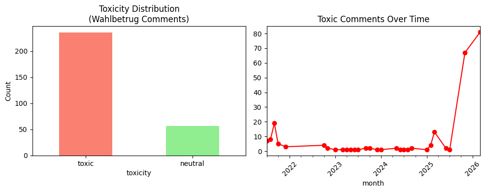

# YouTube Political Toxicity Analysis — German Election Discourse

A pilot study analyzing toxicity patterns in YouTube comments around political misinformation keywords, with a focus on German electoral discourse.

---

## Overview

This project collects YouTube comments using the YouTube Data API v3 and classifies their toxicity using a pre-trained German BERT-based classifier. The analysis focuses on comments related to the keyword **"Wahlbetrug"** (election fraud) — a term frequently associated with political misinformation narratives in Germany.

The goal is to explore how toxic discourse around election-related misinformation evolves over time, particularly around major political events such as federal elections.

---

## Key Findings

- **80% of collected comments (236/293) were classified as toxic**, reflecting the highly polarized nature of election fraud narratives on YouTube
- A clear **temporal spike in toxic comments was observed around the 2022 German federal election aftermath** and again in **early 2026 during the federal election period**
- The time-series pattern suggests that **election events are strong predictors of toxic misinformation activity** on YouTube



---

## Methodology

### Data Collection
- **Platform**: YouTube (via YouTube Data API v3)
- **Keyword**: `Wahlbetrug Deutschland` (election fraud Germany)
- **Region filter**: `DE` (Germany)
- **Language filter**: German
- **Sample size**: 293 comments from 10 videos

### Toxicity Classification
- **Model**: [`EIStakovskii/german_toxicity_classifier_plus_v2`](https://huggingface.co/EIStakovskii/german_toxicity_classifier_plus_v2)
- **Architecture**: BERT-based sequence classifier fine-tuned on German toxic content
- **Labels**: `toxic` / `neutral`

### Analysis
- Label distribution analysis
- Time-series visualization of toxic comment frequency by month

---

## Pipeline

```
YouTube Data API v3
        │
        ▼
Comment Collection (by keyword + region filter)
        │
        ▼
Text Preprocessing (truncation, date parsing)
        │
        ▼
German Toxicity Classifier (HuggingFace Transformers)
        │
        ▼
Temporal Analysis + Visualization
```

---

## Tech Stack

| Tool | Purpose |
|------|---------|
| `google-api-python-client` | YouTube Data API access |
| `transformers` | Pre-trained German toxicity classifier |
| `pandas` | Data manipulation |
| `matplotlib` / `seaborn` | Visualization |
| Google Colab | Runtime environment |

---

## Relevance to Misinformation Research

This pilot is designed as a proof-of-concept for larger-scale political misinformation detection pipelines. It directly addresses:

- **Automated detection** of toxic political discourse using NLP
- **Temporal dynamics** of misinformation spread around real-world political events
- **German-language content** analysis, relevant to ongoing research on disinformation in German-speaking media ecosystems (e.g., WIEGE project)

Future extensions include:
- Expanding keyword set (`Impfpflicht`, `Klimaschwindel`, `Lügenpresse`)
- Comparing moderation policy effects (permissive vs. strict thresholds) — building on prior [Fairness-Audit](https://github.com/JiyeJung/Fairness-Audit) work
- Snowball sampling via channel-level crawling to map misinformation networks
- Integration with fact-check databases (Correctiv, IFCN) for labeled ground truth

---

## Repository Structure

```
├── notebooks/
│   └── youtube_toxicity_analysis.ipynb
├── data/
│   └── youtube_comments.csv
├── plots/
│   └── toxicity_plot.png
└── README.md
```

---

## Author

**Jiye Jung**  
MSc Artificial Intelligence and Data Science  
Heinrich Heine University Düsseldorf
